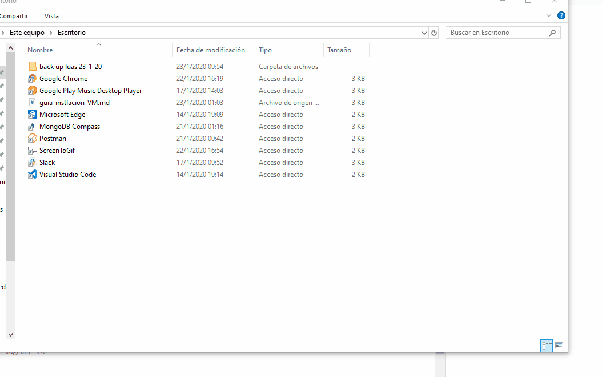
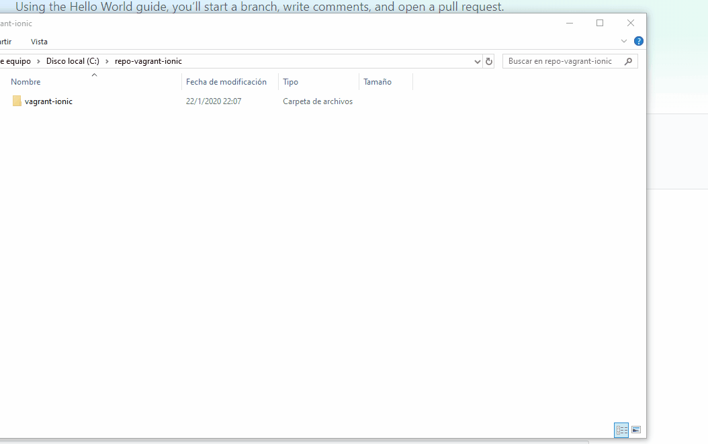

# Empezamos con la instalacion!

Este [repo de github](https://bit.ly/2RjT56U)  es tu amigo ya que nos va a servir para tener todo listo

## Instalando VirtualBox
Aca viene la primera precaucion, debemos instalar una version virtual box compatible con vagrant. en mi caso instale la version 6.0 
 - versiones de Virtual Box: [Link](https://www.virtualbox.org/wiki/Download_Old_Builds)
 - Donde encontre la solucion: [ Link  a github ]( https://github.com/rapid7/metasploitable3/issues/200#issuecomment-576124485)
 
## Instalando Vagrand y ejecutar comandos
Vagrant lo instale lo mas pancho , te pide ejecutar:
 > -   Install vagrant-vbguest plugin  `vagrant plugin install vagrant-vbguest`
> -  Install vagrant fsnotify plugin  `vagrant plugin install vagrant-fsnotify`

de ahora en adelante necesitamos una terminal, te recomiendo que bajes [ Git ](https://git-scm.com/) que viene con gitbash, luego de instalarlo haces click derecho, git bash here y se te abre una consola

Y podes ejecutar:

> vagrant --version

si te devuelve un numero significa que esta instalado y ejecutas los dos comandos de arriba 
## Git clone y Vagrant up
si no sabes como funcion git clone, la idea es muy sencilla, te descargas los archivos del programa que otra persona lo subio. el comando lo ejecutas en la carpeta en donde queres que se guarde . en mi caso cree una carpeta que se llama vagrant_clone y ahi abre una termina de gitbash y ejecute 
> 1.  `git clone https://github.com/csernam/vagrant-ionic`

cuando termine vas a ver que adentro tenes otro carpeta entras a esa y abrimos otra terminal para ejecutar los dos comandos que nos faltan `vagrant up` y `vagrant ssh`

## ¿Y ahora? 
bueno si todo salio bien te salio algo como esto: 

y basicamente estamos dentro de otra computadora que viene con todo lo necesario para armar apks con cordova.

### comandos utiles :
- `ls` para listar los carpetas y archivos de donde estas parado
- `mkdir` creas una carpeta 
- `vagrant halt` cerras la VM y te podes volver a conectarte (tengo que aprender como reconectarme :P)

## creando una app
y bueno ahora vamos a crear una carpeta donde vamos a guardar todos nuestros proyectos en particular hice
`mkdir devel` para crear una carpeta que se llama devel, entras con `cd devel` y ahi vas a la explicacion de cordova para armar la primera app [https://cordova.apache.org/#getstarted](https://cordova.apache.org/#getstarted)

la guia consta de 4 pasos , hacemos todos menos el ultimo vamos que en vez de hacer: 
`cordova run browser --external`
esto lo hice por que queremos ver , en nuestra maquina a travez de google por ejemplo lo que la maquina virtual esta ejecutando 

y para ver que esta pasando simplemente te vas a: 
>  http://192.168.2.2: + el puerto que te dice la consola en mi caso 8000
>  http://192.168.2.2:8000

deberias ser capaz de ver el starter template de cordova

